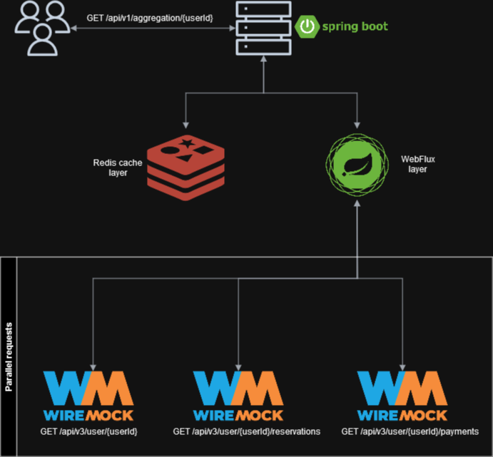

# Spring WebFlux and Caching PoC

This application shows the following:

- How to configure Spring WebFlux and make parallel HTTP requests, and aggregate the results.
- How to configure Spring Caching with Redis to reduce amount of outgoing requests.

Since this is a PoC, only local running is supported. All requests (both incoming and outgoing), and 
all caching operations are verbosely logged.

# Application overview

This diagram illustrates how the application works.



An artificial delay is added to WireMock responses, so that the effectiveness of caching can be seen. Dummy 
authentication is used in the form of a bearer token, which WireMock checks.

# Effects of caching and parallelism

This table shows the response times from the app:

| Cache miss | Cache hit |
|------------|-----------|
| 4037 ms    | 27 ms     |

Two conclusions can be drawn:

- Caching is highly effective when the operations that takes a long time is repeated.
- There is true parallelism happening inside Spring WebFlux. Each request is delayed by 3 seconds by WireMock, so if the requests 
were sequential, the time of completion would be at least 9 seconds, but it was only around 4.

# How to run

Start the required containers:

```bash
docker compose up -d
```

This will launch a Redis and a WireMock container. Redis is the cache backend, while WireMock is the substitute 
for a real external API.

Now the application is ready to start. Either use a run configuration in your IDE, or it can be done 
with the following Maven command:

```bash
mvn spring-boot:run
```